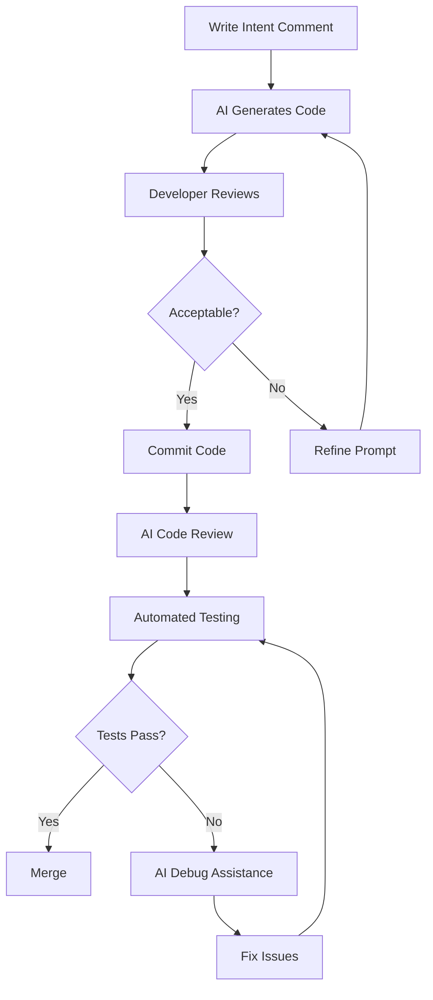

# AI-Assisted AOSP Development

## Overview

Leverage cutting-edge AI technologies to accelerate Android Open Source Project (AOSP) development with intelligent code completion, automated code reviews, and AI-powered debugging.

## Table of Contents

1. [GitHub Copilot Integration](#github-copilot-integration)
2. [AI Code Review Tools](#ai-code-review-tools)
3. [Intelligent Debugging](#intelligent-debugging)
4. [AI-Powered Code Generation](#ai-powered-code-generation)
5. [Machine Learning Model Integration](#machine-learning-model-integration)

## GitHub Copilot Integration

### Workspace Configuration

Configure GitHub Copilot for optimal AOSP development:

```json
{
  "github.copilot.enable": {
    "*": true,
    "cpp": true,
    "java": true,
    "kotlin": true,
    "python": true,
    "xml": true
  },
  "github.copilot.advanced": {
    "authProvider": "github",
    "length": 500,
    "temperature": 0.2,
    "top_p": 1
  }
}
```

### AOSP-Specific Prompts

Create contextual prompts for AOSP development:

**Example: Creating a HAL (Hardware Abstraction Layer)**

```cpp
// Prompt: Create a camera HAL implementation for Android 14
// with support for multi-camera and computational photography

#include <hardware/camera3.h>
#include <system/camera_metadata.h>

class CameraHAL : public camera3_device_t {
  // AI will suggest complete implementation
};
```

### Copilot Best Practices

1. **Context-Rich Comments**: Provide detailed comments to guide AI suggestions
2. **AOSP Pattern Recognition**: Use standard AOSP coding patterns
3. **Security Annotations**: Include security requirements in prompts
4. **Performance Hints**: Specify performance expectations

## AI Code Review Tools

### Automated Code Review Integration

#### 1. CodeRabbit

Configure CodeRabbit for AOSP code reviews:

```yaml
# .coderabbit.yaml
language: "cpp"
rules:
  - name: "AOSP Code Style"
    pattern: ".*\\.cpp$"
    checks:
      - "naming_conventions"
      - "memory_safety"
      - "thread_safety"
  - name: "Security Checks"
    severity: "error"
    patterns:
      - "buffer_overflow"
      - "use_after_free"
      - "race_condition"

reviews:
  auto_review: true
  check_security: true
  check_performance: true
```

#### 2. Amazon CodeGuru

Integration with CodeGuru for advanced analysis:

```bash
# Install CodeGuru CLI
pip install aws-codeguru-cli

# Analyze AOSP code
codeguru-cli analyze \
  --repo-root ~/aosp \
  --language cpp,java \
  --output-format json \
  --security-scan \
  --performance-scan
```

#### 3. DeepCode (Snyk Code)

```bash
# Install Snyk
npm install -g snyk

# Authenticate
snyk auth

# Run security and code quality scan
snyk code test ~/aosp --severity-threshold=medium
```

### AI Review Integration in CI/CD

```yaml
# .github/workflows/ai-code-review.yml
name: AI Code Review
on: [pull_request]

jobs:
  ai-review:
    runs-on: ubuntu-latest
    steps:
      - uses: actions/checkout@v4
      - name: Run CodeRabbit
        uses: coderabbitai/openai-pr-reviewer@latest
        with:
          github_token: ${{ secrets.GITHUB_TOKEN }}
          openai_api_key: ${{ secrets.OPENAI_API_KEY }}
      - name: Run Snyk Code
        uses: snyk/actions/node@master
        env:
          SNYK_TOKEN: ${{ secrets.SNYK_TOKEN }}
```

## Intelligent Debugging

### AI-Powered Debugger: GDB + AI

Integrate AI with GDB for intelligent debugging:

```python
# scripts/ai_debugger.py
import gdb
import openai
import json

class AIDebugger(gdb.Command):
    """AI-assisted debugging for AOSP"""
    
    def __init__(self):
        super(AIDebugger, self).__init__("ai-debug", gdb.COMMAND_USER)
        openai.api_key = os.environ.get("OPENAI_API_KEY")
    
    def invoke(self, args, from_tty):
        # Get current stack trace
        frame = gdb.selected_frame()
        backtrace = gdb.execute("bt", to_string=True)
        locals_vars = gdb.execute("info locals", to_string=True)
        
        # Send to AI for analysis
        prompt = f"""
        Analyze this AOSP debugging scenario:
        
        Backtrace:
        {backtrace}
        
        Local Variables:
        {locals_vars}
        
        Suggest potential root causes and debugging steps.
        """
        
        response = openai.ChatCompletion.create(
            model="gpt-4",
            messages=[{"role": "user", "content": prompt}]
        )
        
        print(response.choices[0].message.content)

AIDebugger()
```

Usage:

```bash
# Start GDB with AI debugger
gdb -x scripts/ai_debugger.py ./out/target/product/generic/system/bin/app_process

# Inside GDB
(gdb) ai-debug
```

### Crash Analysis with AI

```python
# scripts/crash_analyzer.py
import re
import openai
from pathlib import Path

def analyze_crash_log(log_path):
    """Analyze Android crash logs using AI"""
    
    with open(log_path, 'r') as f:
        log_content = f.read()
    
    # Extract relevant information
    crash_pattern = r"FATAL EXCEPTION: (.+?)(?=\n\n|\Z)"
    stack_trace = re.search(crash_pattern, log_content, re.DOTALL)
    
    if stack_trace:
        prompt = f"""
        Analyze this Android crash log and provide:
        1. Root cause analysis
        2. Potential fixes
        3. Prevention strategies
        
        Crash Log:
        {stack_trace.group(0)}
        """
        
        response = openai.ChatCompletion.create(
            model="gpt-4",
            messages=[{"role": "user", "content": prompt}],
            temperature=0.3
        )
        
        return response.choices[0].message.content
    
    return "No crash found in log"

if __name__ == "__main__":
    import sys
    result = analyze_crash_log(sys.argv[1])
    print(result)
```

## AI-Powered Code Generation

### Automated HAL Generation

```python
# scripts/generate_hal.py
import openai
from jinja2 import Template

def generate_hal(device_type, android_version):
    """Generate HAL boilerplate using AI"""
    
    prompt = f"""
    Generate a complete Android {android_version} HAL implementation for {device_type}.
    Include:
    - Header files
    - Implementation files
    - Android.bp build configuration
    - HIDL/AIDL interface definitions
    - Vendor implementation
    
    Follow AOSP coding standards and security best practices.
    """
    
    response = openai.ChatCompletion.create(
        model="gpt-4",
        messages=[{"role": "user", "content": prompt}],
        temperature=0.4,
        max_tokens=4000
    )
    
    return response.choices[0].message.content

# Usage
hal_code = generate_hal("camera", "android-14")
print(hal_code)
```

### Service Implementation Generator

```bash
#!/bin/bash
# scripts/generate_service.sh

SERVICE_NAME=$1
PACKAGE_NAME=$2

# Use AI to generate service
python3 << EOF
import openai
import os

openai.api_key = os.environ['OPENAI_API_KEY']

response = openai.ChatCompletion.create(
    model="gpt-4",
    messages=[{
        "role": "user",
        "content": f"""
        Generate a complete Android system service implementation:
        Service Name: ${SERVICE_NAME}
        Package: ${PACKAGE_NAME}
        
        Include:
        - AIDL interface
        - Service implementation
        - Client library
        - SELinux policies
        - Android.bp configuration
        """
    }]
)

print(response.choices[0].message.content)
EOF
```

## Machine Learning Model Integration

### TensorFlow Lite Integration

```cpp
// Example: AI-powered camera enhancement
#include <tensorflow/lite/interpreter.h>
#include <tensorflow/lite/kernels/register.h>
#include <tensorflow/lite/model.h>

class AIImageProcessor {
public:
    bool LoadModel(const char* model_path) {
        model_ = tflite::FlatBufferModel::BuildFromFile(model_path);
        if (!model_) return false;
        
        tflite::ops::builtin::BuiltinOpResolver resolver;
        tflite::InterpreterBuilder builder(*model_, resolver);
        builder(&interpreter_);
        
        interpreter_->AllocateTensors();
        return true;
    }
    
    void ProcessImage(const uint8_t* input, uint8_t* output) {
        // Copy input to tensor
        auto input_tensor = interpreter_->typed_input_tensor<uint8_t>(0);
        memcpy(input_tensor, input, input_size_);
        
        // Run inference
        interpreter_->Invoke();
        
        // Get output
        auto output_tensor = interpreter_->typed_output_tensor<uint8_t>(0);
        memcpy(output, output_tensor, output_size_);
    }

private:
    std::unique_ptr<tflite::FlatBufferModel> model_;
    std::unique_ptr<tflite::Interpreter> interpreter_;
    size_t input_size_;
    size_t output_size_;
};
```

### AI Model Training Pipeline

```python
# scripts/train_optimization_model.py
import tensorflow as tf
import numpy as np
from pathlib import Path

def train_build_optimizer():
    """Train model to predict optimal build configurations"""
    
    # Load historical build data
    data = load_build_metrics()
    
    # Feature engineering
    features = extract_features(data)
    labels = extract_labels(data)
    
    # Build model
    model = tf.keras.Sequential([
        tf.keras.layers.Dense(128, activation='relu'),
        tf.keras.layers.Dropout(0.2),
        tf.keras.layers.Dense(64, activation='relu'),
        tf.keras.layers.Dense(32, activation='relu'),
        tf.keras.layers.Dense(1, activation='sigmoid')
    ])
    
    model.compile(
        optimizer='adam',
        loss='binary_crossentropy',
        metrics=['accuracy']
    )
    
    # Train
    model.fit(features, labels, epochs=100, validation_split=0.2)
    
    # Save model
    model.save('models/build_optimizer.h5')
    
    return model

if __name__ == "__main__":
    train_build_optimizer()
```

## Best Practices

### 1. AI-Assisted Development Workflow



### 2. Security Considerations

- **Never expose API keys in code**: Use environment variables or secrets management
- **Review AI-generated code**: Always verify security-critical sections
- **Use AI for audit**: Leverage AI to find security vulnerabilities
- **Model security**: Ensure ML models are from trusted sources

### 3. Performance Optimization

- **Context window management**: Keep prompts concise and relevant
- **Caching**: Cache AI responses for similar queries
- **Batch processing**: Process multiple files in batches
- **Incremental analysis**: Only analyze changed code

## Tools and Resources

### Essential AI Tools for AOSP Development

| Tool | Purpose | Integration |
|------|---------|-------------|
| GitHub Copilot | Code completion | VS Code, IntelliJ |
| TabNine | AI autocomplete | Multi-IDE |
| Sourcery | Code refactoring | Python |
| CodeGuru | Performance analysis | AWS |
| DeepCode | Security scanning | CI/CD |
| Kite | Documentation | Multi-IDE |

### AI API Resources

```bash
# Set up API keys
export OPENAI_API_KEY="your-key-here"
export ANTHROPIC_API_KEY="your-key-here"
export COHERE_API_KEY="your-key-here"

# Install AI SDKs
pip install openai anthropic cohere
pip install langchain chromadb
```

### Training Resources

- [GitHub Copilot for AOSP](https://github.com/features/copilot)
- [OpenAI API Documentation](https://platform.openai.com/docs)
- [TensorFlow Lite for Android](https://www.tensorflow.org/lite/android)
- [AI-Assisted Programming Course](https://www.deeplearning.ai/)

## Future Enhancements

- **Multimodal AI**: Use vision models to analyze UI screenshots
- **Voice-Controlled Development**: Voice commands for coding
- **Predictive Build Optimization**: AI predicts build times and resource needs
- **Automated Documentation**: AI generates documentation from code
- **Intelligent Code Migration**: AI assists in upgrading to new Android versions

## Conclusion

AI-assisted development represents the future of AOSP engineering, enabling developers to work faster, write better code, and build more innovative Android systems. By integrating these tools into your workflow, you can leverage the power of artificial intelligence to enhance every aspect of the development process.
