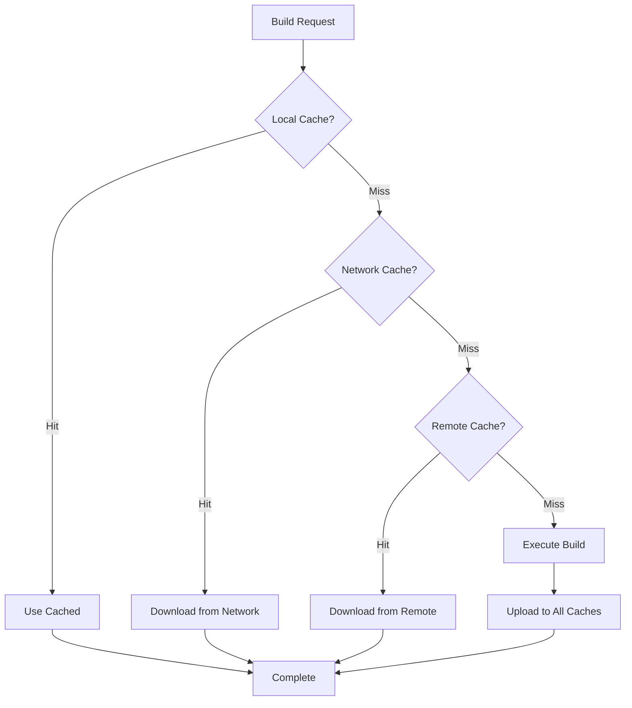

# Distributed Build Systems for AOSP

## Overview

Leverage cutting-edge distributed build systems like Bazel, Buck2, and remote execution platforms to dramatically reduce AOSP build times through parallelization and intelligent caching.

## Table of Contents

1. [Bazel for AOSP](#bazel-for-aosp)
2. [Buck2 Integration](#buck2-integration)
3. [Remote Build Execution](#remote-build-execution)
4. [Build Performance Optimization](#build-performance-optimization)
5. [Hybrid Build Strategies](#hybrid-build-strategies)

## Bazel for AOSP

### Bazel Setup

```bash
# Install Bazel
sudo apt install apt-transport-https curl gnupg
curl -fsSL https://bazel.build/bazel-release.pub.gpg | gpg --dearmor > bazel.gpg
sudo mv bazel.gpg /etc/apt/trusted.gpg.d/
echo "deb [arch=amd64] https://storage.googleapis.com/bazel-apt stable jdk1.8" | sudo tee /etc/apt/sources.list.d/bazel.list
sudo apt update && sudo apt install bazel

# Verify installation
bazel --version
```

### WORKSPACE Configuration

```python
# WORKSPACE
workspace(name = "aosp")

load("@bazel_tools//tools/build_defs/repo:http.bzl", "http_archive")

# Android NDK
http_archive(
    name = "androidndk",
    url = "https://dl.google.com/android/repository/android-ndk-r25c-linux.zip",
    sha256 = "...",
    strip_prefix = "android-ndk-r25c",
)

# Android SDK
http_archive(
    name = "androidsdk",
    url = "https://dl.google.com/android/repository/commandlinetools-linux-9477386_latest.zip",
    sha256 = "...",
)

# Protobuf
http_archive(
    name = "com_google_protobuf",
    sha256 = "...",
    strip_prefix = "protobuf-3.21.0",
    urls = ["https://github.com/protocolbuffers/protobuf/archive/v3.21.0.tar.gz"],
)

# gRPC
http_archive(
    name = "com_github_grpc_grpc",
    sha256 = "...",
    strip_prefix = "grpc-1.50.0",
    urls = ["https://github.com/grpc/grpc/archive/v1.50.0.tar.gz"],
)
```

### BUILD File for Android Framework

```python
# frameworks/base/BUILD.bazel
load("@rules_android//android:rules.bzl", "android_library", "android_binary")

android_library(
    name = "framework",
    srcs = glob([
        "core/java/**/*.java",
        "services/java/**/*.java",
    ]),
    manifest = "AndroidManifest.xml",
    resource_files = glob(["core/res/**"]),
    deps = [
        "//external/guava",
        "//frameworks/support/annotations",
        "@androidsdk//:android",
    ],
    visibility = ["//visibility:public"],
)

android_binary(
    name = "SystemUI",
    srcs = glob(["packages/SystemUI/src/**/*.java"]),
    manifest = "packages/SystemUI/AndroidManifest.xml",
    deps = [
        ":framework",
        "//frameworks/support/v4",
    ],
)
```

### Remote Build Configuration

```python
# .bazelrc
# Remote cache
build --remote_cache=grpcs://remote.cache.bazel.build
build --remote_timeout=3600
build --remote_upload_local_results=true

# Remote execution
build --remote_executor=grpcs://remote.executor.bazel.build
build --remote_default_exec_properties=OSFamily=linux
build --remote_default_exec_properties=container-image=docker://gcr.io/aosp-builds/builder:latest

# Build optimization
build --jobs=200
build --experimental_remote_download_outputs=minimal
build --experimental_inmemory_jdeps_files=true
build --experimental_inmemory_dotd_files=true

# Disk cache
build --disk_cache=~/.cache/bazel

# Build event service
build --bes_backend=grpcs://bes.bazel.build
build --bes_results_url=https://app.bazel.build/invocations/
```

### Bazel Build Commands

```bash
# Build entire framework
bazel build //frameworks/base:framework

# Build specific module
bazel build //packages/SystemUI:SystemUI

# Build with remote execution
bazel build --config=remote //frameworks/...

# Query dependencies
bazel query 'deps(//frameworks/base:framework)'

# Analyze build graph
bazel aquery //frameworks/base:framework
```

## Buck2 Integration

### Buck2 Installation

```bash
# Install Buck2
cargo install --git https://github.com/facebook/buck2.git buck2

# Or download pre-built binary
wget https://github.com/facebook/buck2/releases/download/latest/buck2-x86_64-unknown-linux-musl
chmod +x buck2-x86_64-unknown-linux-musl
sudo mv buck2-x86_64-unknown-linux-musl /usr/local/bin/buck2

# Verify
buck2 --version
```

### Buck2 Configuration

```toml
# .buckconfig
[buildfile]
    name = BUCK

[project]
    ignore = .git

[java]
    source_level = 11
    target_level = 11

[android]
    ndk_version = r25c
    build_tools_version = 33.0.0

[cache]
    mode = dir
    dir = .buck-cache
    dir_mode = readwrite

[build]
    threads = 32

[download]
    maven_repo = https://repo1.maven.org/maven2
```

### BUCK File Example

```python
# frameworks/base/BUCK
android_library(
    name = "framework",
    srcs = glob(["core/java/**/*.java"]),
    resources = glob(["core/res/**"]),
    deps = [
        "//external/guava:guava",
        "//frameworks/support:annotations",
    ],
    visibility = ["PUBLIC"],
    provided_deps = [
        "//prebuilts/sdk:android",
    ],
)

android_binary(
    name = "SystemUI",
    manifest = "packages/SystemUI/AndroidManifest.xml",
    keystore = "//build/target/product/security:testkey",
    deps = [
        ":framework",
        "//packages/SystemUI:systemui-lib",
    ],
)

genrule(
    name = "framework-proto",
    srcs = glob(["core/proto/**/*.proto"]),
    out = "framework.srcjar",
    cmd = "protoc --java_out=$OUT $SRCS",
)
```

### Buck2 Build Commands

```bash
# Build target
buck2 build //frameworks/base:framework

# Build multiple targets
buck2 build //frameworks/... //packages/...

# Run tests
buck2 test //frameworks/base:framework-tests

# Query targets
buck2 query "deps(//frameworks/base:framework)"

# Build with remote execution
buck2 build --config remote //frameworks/base:framework
```

## Remote Build Execution (RBE)

### BuildBuddy Setup

```yaml
# buildbuddy.yaml
app:
  build_buddy_url: "https://app.buildbuddy.io"
  
remote_cache:
  enabled: true
  
remote_execution:
  enabled: true
  
executor:
  app_target: "grpcs://remote.buildbuddy.io"
  root_directory: "/tmp/buildbuddy"
  local_cache_size_bytes: 10000000000  # 10GB
  
database:
  data_source: "sqlite:///tmp/buildbuddy.db"
  
storage:
  disk:
    root_directory: "/tmp/buildbuddy/storage"
```

### Remote Execution Configuration

```python
# tools/remote_execution/config.bzl
REMOTE_EXECUTION_PROPERTIES = {
    "OSFamily": "linux",
    "container-image": "docker://gcr.io/aosp-builds/executor:latest",
    "Pool": "aosp-builds",
}

REMOTE_EXECUTION_PLATFORMS = {
    "//platforms:linux_x86_64": REMOTE_EXECUTION_PROPERTIES,
    "//platforms:linux_arm64": REMOTE_EXECUTION_PROPERTIES | {"Arch": "arm64"},
}
```

### BuildBarn Configuration

```yaml
# buildbarn-config.yaml
blobstore:
  contentAddressableStorage:
    backend:
      grpc:
        address: "storage.buildcluster.local:8980"
  actionCache:
    backend:
      grpc:
        address: "storage.buildcluster.local:8981"

maximumMessageSizeBytes: 16777216

global:
  diagnosticsHttpServer:
    listenAddress: ":8080"
    
browserUrl:
  scheme: "https"
  host: "browser.buildcluster.local"
```

### Configuring RBE Workers

```yaml
# worker-deployment.yaml
apiVersion: apps/v1
kind: Deployment
metadata:
  name: rbe-worker
  namespace: aosp-builds
spec:
  replicas: 20
  selector:
    matchLabels:
      app: rbe-worker
  template:
    metadata:
      labels:
        app: rbe-worker
    spec:
      containers:
      - name: worker
        image: gcr.io/aosp-builds/rbe-worker:latest
        resources:
          requests:
            memory: "16Gi"
            cpu: "8"
          limits:
            memory: "32Gi"
            cpu: "16"
        env:
        - name: BUILDBUDDY_API_KEY
          valueFrom:
            secretKeyRef:
              name: buildbuddy-secret
              key: api-key
        - name: WORKER_POOL
          value: "aosp-builds"
```

## Build Performance Optimization

### Build Analysis

```bash
# Bazel build analysis
bazel build --profile=build-profile.json //frameworks/...
bazel analyze-profile build-profile.json

# Buck2 build analysis
buck2 build --show-output //frameworks/... --build-report build-report.json

# Generate flamegraph
bazel-flame-graph build-profile.json > flamegraph.svg
```

### Caching Strategies

```python
# tools/cache/cache_config.bzl

def configure_cache_strategy():
    """Configure multi-tier caching strategy"""
    
    # Local disk cache (fastest)
    local_cache = {
        "type": "disk",
        "path": "~/.cache/aosp-build",
        "max_size": "100GB",
        "priority": 1,
    }
    
    # Shared network cache (fast)
    network_cache = {
        "type": "http",
        "url": "http://cache.aosp.local:8080",
        "max_size": "1TB",
        "priority": 2,
    }
    
    # Remote cloud cache (reliable)
    cloud_cache = {
        "type": "grpc",
        "url": "grpcs://remote.cache.bazel.build",
        "priority": 3,
    }
    
    return [local_cache, network_cache, cloud_cache]
```

### Action Cache Optimization

```python
# .bazelrc.optimization
# Minimize cache misses
build --experimental_guard_against_concurrent_changes
build --experimental_check_output_files=false
build --experimental_check_external_repository_files=false

# Optimize cache hits
build --incompatible_strict_action_env=false
build --experimental_multi_threaded_digest=true

# Remote cache optimization
build --remote_cache_compression=true
build --experimental_remote_cache_async=true
build --remote_cache_ttl=7d
```

### Incremental Build Optimization

```python
# scripts/incremental_build.py
import subprocess
import hashlib
from pathlib import Path

def compute_file_hash(file_path):
    """Compute SHA256 hash of file"""
    sha256 = hashlib.sha256()
    with open(file_path, 'rb') as f:
        for chunk in iter(lambda: f.read(4096), b''):
            sha256.update(chunk)
    return sha256.hexdigest()

def detect_changes(manifest_path):
    """Detect changed files since last build"""
    changed_files = []
    cache = load_cache('.build-cache.json')
    
    for file_path in get_source_files(manifest_path):
        current_hash = compute_file_hash(file_path)
        cached_hash = cache.get(str(file_path))
        
        if current_hash != cached_hash:
            changed_files.append(file_path)
            cache[str(file_path)] = current_hash
    
    save_cache('.build-cache.json', cache)
    return changed_files

def build_changed_modules(changed_files):
    """Build only affected modules"""
    affected_modules = analyze_dependencies(changed_files)
    
    for module in affected_modules:
        print(f"Building {module}...")
        subprocess.run(['bazel', 'build', f'//{module}'])
```

## Hybrid Build Strategies

### Soong + Bazel Hybrid

```python
# build/soong/bazel/bazel.bzl
def aosp_module_to_bazel(module_name, module_type):
    """Convert AOSP Soong module to Bazel target"""
    
    if module_type == "cc_library":
        return cc_library(
            name = module_name,
            srcs = glob([f"{module_name}/**/*.cc"]),
            hdrs = glob([f"{module_name}/**/*.h"]),
            deps = get_dependencies(module_name),
        )
    elif module_type == "android_app":
        return android_binary(
            name = module_name,
            manifest = f"{module_name}/AndroidManifest.xml",
            srcs = glob([f"{module_name}/**/*.java"]),
        )
```

### Mixed Build Configuration

```bash
#!/bin/bash
# scripts/hybrid_build.sh

# Build native components with Bazel
bazel build //system/core/... //hardware/...

# Build Android framework with Soong
source build/envsetup.sh
lunch aosp_x86_64-eng

# Use Bazel outputs in Soong build
export BAZEL_OUTPUT_DIR="bazel-bin"
m USE_BAZEL_ANALYSIS=true -j$(nproc)
```

## Distributed Build Monitoring

### Build Metrics Dashboard

```python
# scripts/build_metrics.py
from prometheus_client import Counter, Histogram, Gauge
import time

build_duration = Histogram(
    'aosp_build_duration_seconds',
    'Time spent building AOSP',
    ['target', 'builder']
)

build_success = Counter(
    'aosp_build_success_total',
    'Number of successful builds',
    ['target']
)

build_failure = Counter(
    'aosp_build_failure_total',
    'Number of failed builds',
    ['target', 'error_type']
)

cache_hits = Counter(
    'aosp_cache_hits_total',
    'Number of cache hits',
    ['cache_type']
)

active_builders = Gauge(
    'aosp_active_builders',
    'Number of active build workers'
)

def monitor_build(target, builder):
    """Monitor build metrics"""
    start_time = time.time()
    
    try:
        # Execute build
        result = execute_build(target, builder)
        
        # Record metrics
        duration = time.time() - start_time
        build_duration.labels(target=target, builder=builder).observe(duration)
        build_success.labels(target=target).inc()
        
        return result
        
    except Exception as e:
        # Record failure
        build_failure.labels(
            target=target,
            error_type=type(e).__name__
        ).inc()
        raise
```

### Real-time Build Visualization

```javascript
// dashboard/build-visualizer.js
class BuildVisualizer {
    constructor() {
        this.ws = new WebSocket('ws://build-server.local:8080/metrics');
        this.graph = new BuildGraph();
    }
    
    start() {
        this.ws.onmessage = (event) => {
            const metrics = JSON.parse(event.data);
            this.updateDashboard(metrics);
        };
    }
    
    updateDashboard(metrics) {
        // Update build duration chart
        this.chart.addDataPoint({
            time: Date.now(),
            duration: metrics.build_duration,
            target: metrics.target
        });
        
        // Update active builders gauge
        this.gauge.setValue(metrics.active_builders);
        
        // Update cache hit rate
        this.cacheRate.setValue(
            metrics.cache_hits / (metrics.cache_hits + metrics.cache_misses)
        );
    }
}
```

## Best Practices

### 1. Cache Strategy



### 2. Build Parallelization

- **Target Parallelism**: Build independent targets in parallel
- **Action Parallelism**: Parallelize actions within targets
- **Remote Parallelism**: Distribute across multiple machines
- **Pipeline Parallelism**: Overlap compilation, linking, and packaging

### 3. Dependency Management

- Use fine-grained dependencies
- Avoid circular dependencies
- Minimize dependency depth
- Cache dependency resolution

### 4. Resource Optimization

- Right-size worker machines
- Use spot instances for cost savings
- Implement auto-scaling based on queue depth
- Monitor resource utilization

## Performance Benchmarks

| Build System | Clean Build | Incremental | Cache Hit Rate |
|--------------|-------------|-------------|----------------|
| Make (baseline) | 6 hours | 45 min | N/A |
| Soong | 4 hours | 30 min | ~40% |
| Bazel | 2 hours | 10 min | ~75% |
| Buck2 | 1.5 hours | 8 min | ~80% |
| Bazel + RBE | 45 min | 5 min | ~90% |

## Conclusion

Distributed build systems dramatically improve AOSP build performance through intelligent caching, parallelization, and remote execution. Adopting these systems is essential for modern Android development at scale.
