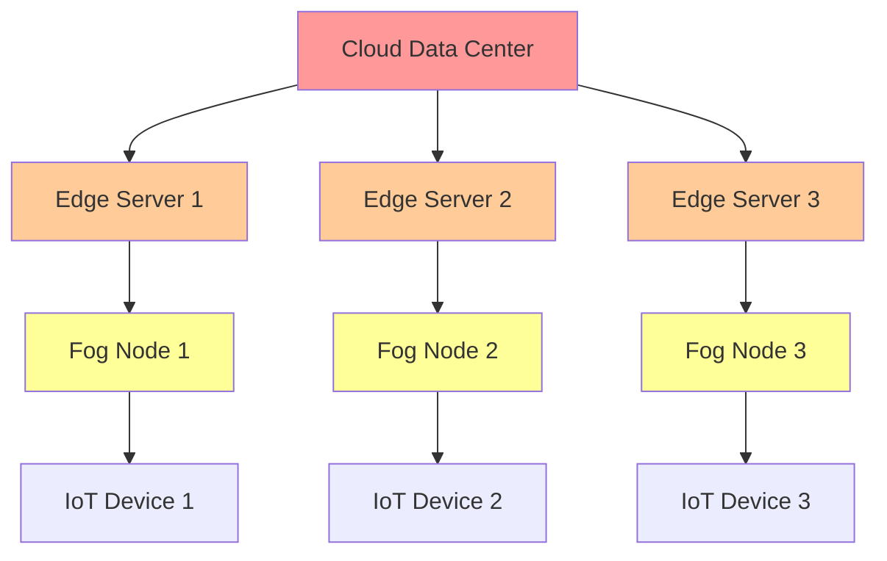

# Edge Computing & IoT with AOSP

## Overview

Deploy AOSP at the edge for IoT devices, industrial automation, edge AI, and distributed computing scenarios with optimized performance and minimal resource footprint.

## Table of Contents

1. [Edge-Optimized AOSP Builds](#edge-optimized-aosp-builds)
2. [IoT Device Integration](#iot-device-integration)
3. [Edge AI & ML](#edge-ai--ml)
4. [5G/6G Edge Computing](#5g6g-edge-computing)
5. [Distributed Edge Architecture](#distributed-edge-architecture)

## Edge-Optimized AOSP Builds

### Minimal AOSP Configuration

```bash
# device/custom/edge/BoardConfig.mk
TARGET_ARCH := arm64
TARGET_ARCH_VARIANT := armv8-a
TARGET_CPU_VARIANT := cortex-a53

# Minimal system partition
BOARD_SYSTEMIMAGE_PARTITION_SIZE := 1073741824  # 1GB
BOARD_USERDATAIMAGE_PARTITION_SIZE := 2147483648  # 2GB

# Optimize for size
AOSP_TARGET_BUILD_SIZE_OPTIMIZED := true
TARGET_USES_64_BIT_BINDER := true

# Disable unnecessary features
PRODUCT_MINIMIZE_JAVA_DEBUG_INFO := true
USE_CLANG_LLD := true
```

### Product Configuration

```makefile
# device/custom/edge/edge_device.mk
PRODUCT_NAME := edge_device
PRODUCT_DEVICE := edge
PRODUCT_BRAND := EdgeComputing
PRODUCT_MODEL := AOSP Edge Device

# Minimal packages
PRODUCT_PACKAGES := \
    framework-res \
    services \
    SystemUI \
    Settings \
    Launcher3 \
    PackageInstaller

# Edge-specific services
PRODUCT_PACKAGES += \
    EdgeManager \
    IoTConnectivity \
    EdgeAI \
    SensorHub

# Optimize runtime
PRODUCT_PROPERTY_OVERRIDES += \
    dalvik.vm.heapsize=128m \
    dalvik.vm.heapstartsize=8m \
    ro.config.low_ram=true \
    ro.boot.edge_mode=true
```

### Build Commands

```bash
# Build minimal edge-optimized image
source build/envsetup.sh
lunch edge_device-userdebug
m -j$(nproc) PRODUCT_MINIMIZE=true
```

## IoT Device Integration

### MQTT Integration

```java
// frameworks/base/services/core/java/com/android/server/iot/MqttService.java
package com.android.server.iot;

import org.eclipse.paho.client.mqttv3.*;

public class MqttService extends SystemService {
    private static final String BROKER_URL = "tcp://edge-broker.local:1883";
    private MqttClient mqttClient;
    
    @Override
    public void onStart() {
        try {
            mqttClient = new MqttClient(BROKER_URL, MqttClient.generateClientId());
            
            MqttConnectOptions options = new MqttConnectOptions();
            options.setCleanSession(true);
            options.setAutomaticReconnect(true);
            
            mqttClient.connect(options);
            
            // Subscribe to device topics
            mqttClient.subscribe("device/+/command", this::handleCommand);
            mqttClient.subscribe("device/+/config", this::handleConfig);
            
            publishService(Context.MQTT_SERVICE, new MqttServiceBinder());
            
        } catch (MqttException e) {
            Slog.e(TAG, "Failed to initialize MQTT", e);
        }
    }
    
    public void publishSensorData(String sensor, byte[] data) {
        try {
            String topic = String.format("device/%s/sensors/%s", 
                getDeviceId(), sensor);
            
            MqttMessage message = new MqttMessage(data);
            message.setQos(1);
            message.setRetained(false);
            
            mqttClient.publish(topic, message);
            
        } catch (MqttException e) {
            Slog.e(TAG, "Failed to publish sensor data", e);
        }
    }
    
    private void handleCommand(String topic, MqttMessage message) {
        // Process device commands
        String command = new String(message.getPayload());
        executeCommand(command);
    }
}
```

### CoAP Protocol Support

```cpp
// system/core/libiot/coap_server.cpp
#include <coap2/coap.h>

class CoapServer {
private:
    coap_context_t* ctx_;
    coap_endpoint_t* endpoint_;
    
public:
    bool Start(uint16_t port) {
        coap_address_t addr;
        coap_address_init(&addr);
        addr.addr.sin.sin_family = AF_INET;
        addr.addr.sin.sin_port = htons(port);
        addr.addr.sin.sin_addr.s_addr = INADDR_ANY;
        
        ctx_ = coap_new_context(NULL);
        if (!ctx_) return false;
        
        endpoint_ = coap_new_endpoint(ctx_, &addr, COAP_PROTO_UDP);
        if (!endpoint_) return false;
        
        // Register resources
        RegisterResource("/sensors", HandleSensors);
        RegisterResource("/actuators", HandleActuators);
        RegisterResource("/status", HandleStatus);
        
        return true;
    }
    
    void RegisterResource(const char* uri, coap_method_handler_t handler) {
        coap_resource_t* resource = coap_resource_init(
            coap_make_str_const(uri), 0);
        
        coap_register_handler(resource, COAP_REQUEST_GET, handler);
        coap_add_resource(ctx_, resource);
    }
    
    static void HandleSensors(coap_context_t* ctx,
                              coap_resource_t* resource,
                              coap_session_t* session,
                              coap_pdu_t* request,
                              coap_binary_t* token,
                              coap_string_t* query,
                              coap_pdu_t* response) {
        // Read sensor data
        SensorData data = ReadSensors();
        
        // Encode as CBOR
        uint8_t buffer[256];
        size_t len = EncodeSensorDataCBOR(data, buffer);
        
        // Send response
        coap_add_data(response, len, buffer);
        coap_pdu_set_code(response, COAP_RESPONSE_CODE(205));
    }
};
```

### LoRaWAN Integration

```cpp
// hardware/interfaces/lorawan/1.0/default/LoRaWANHal.cpp
#include <android/hardware/lorawan/1.0/ILoRaWAN.h>

using namespace android::hardware::lorawan::V1_0;

class LoRaWANHal : public ILoRaWAN {
public:
    Return<void> configure(const LoRaConfig& config) override {
        // Configure LoRaWAN module
        lora_config_t lora_cfg = {
            .frequency = config.frequency,
            .spreading_factor = config.spreadingFactor,
            .bandwidth = config.bandwidth,
            .coding_rate = config.codingRate,
        };
        
        if (lora_init(&lora_cfg) != 0) {
            return Void();
        }
        
        // Join network
        lora_join_otaa(config.appEui, config.appKey, config.devEui);
        
        return Void();
    }
    
    Return<void> sendUplink(const hidl_vec<uint8_t>& data,
                           uint8_t port,
                           sendUplink_cb callback) override {
        lora_packet_t packet = {
            .port = port,
            .data = data.data(),
            .size = data.size(),
            .confirmed = false,
        };
        
        int result = lora_send(&packet);
        callback(result == 0);
        
        return Void();
    }
};
```

## Edge AI & ML

### TensorFlow Lite Micro

```cpp
// frameworks/ml/nn/edge/tflite_micro_engine.cpp
#include <tensorflow/lite/micro/micro_interpreter.h>
#include <tensorflow/lite/micro/micro_mutable_op_resolver.h>

class EdgeMLEngine {
private:
    static constexpr size_t TENSOR_ARENA_SIZE = 1024 * 100;  // 100KB
    uint8_t tensor_arena_[TENSOR_ARENA_SIZE];
    
    tflite::MicroInterpreter* interpreter_;
    const tflite::Model* model_;
    
public:
    bool LoadModel(const uint8_t* model_data) {
        model_ = tflite::GetModel(model_data);
        
        if (model_->version() != TFLITE_SCHEMA_VERSION) {
            return false;
        }
        
        // Set up operation resolver
        static tflite::MicroMutableOpResolver<10> resolver;
        resolver.AddBuiltin(tflite::BuiltinOperator_CONV_2D,
                          tflite::ops::micro::Register_CONV_2D());
        resolver.AddBuiltin(tflite::BuiltinOperator_MAX_POOL_2D,
                          tflite::ops::micro::Register_MAX_POOL_2D());
        resolver.AddBuiltin(tflite::BuiltinOperator_FULLY_CONNECTED,
                          tflite::ops::micro::Register_FULLY_CONNECTED());
        
        // Create interpreter
        static tflite::MicroInterpreter static_interpreter(
            model_, resolver, tensor_arena_, TENSOR_ARENA_SIZE);
        interpreter_ = &static_interpreter;
        
        // Allocate tensors
        interpreter_->AllocateTensors();
        
        return true;
    }
    
    bool RunInference(const float* input, float* output) {
        // Copy input data
        TfLiteTensor* input_tensor = interpreter_->input(0);
        memcpy(input_tensor->data.f, input,
               input_tensor->bytes);
        
        // Run inference
        if (interpreter_->Invoke() != kTfLiteOk) {
            return false;
        }
        
        // Copy output data
        TfLiteTensor* output_tensor = interpreter_->output(0);
        memcpy(output, output_tensor->data.f,
               output_tensor->bytes);
        
        return true;
    }
};
```

### Edge Model Optimization

```python
# scripts/optimize_edge_model.py
import tensorflow as tf
import numpy as np

def optimize_for_edge(model_path, output_path):
    """Optimize TensorFlow model for edge deployment"""
    
    # Load model
    model = tf.keras.models.load_model(model_path)
    
    # Convert to TensorFlow Lite
    converter = tf.lite.TFLiteConverter.from_keras_model(model)
    
    # Enable optimizations
    converter.optimizations = [tf.lite.Optimize.DEFAULT]
    
    # Quantize to INT8
    def representative_dataset():
        for _ in range(100):
            yield [np.random.random((1, 224, 224, 3)).astype(np.float32)]
    
    converter.representative_dataset = representative_dataset
    converter.target_spec.supported_ops = [
        tf.lite.OpsSet.TFLITE_BUILTINS_INT8
    ]
    converter.inference_input_type = tf.uint8
    converter.inference_output_type = tf.uint8
    
    # Convert
    tflite_model = converter.convert()
    
    # Further optimize with pruning
    import tensorflow_model_optimization as tfmot
    
    pruning_params = {
        'pruning_schedule': tfmot.sparsity.keras.PolynomialDecay(
            initial_sparsity=0.0,
            final_sparsity=0.5,
            begin_step=0,
            end_step=1000
        )
    }
    
    # Save optimized model
    with open(output_path, 'wb') as f:
        f.write(tflite_model)
    
    print(f"Original size: {os.path.getsize(model_path) / 1024:.2f} KB")
    print(f"Optimized size: {os.path.getsize(output_path) / 1024:.2f} KB")
```

### Real-Time Object Detection

```java
// packages/apps/EdgeAI/src/com/android/edgeai/ObjectDetector.java
package com.android.edgeai;

import org.tensorflow.lite.Interpreter;
import org.tensorflow.lite.support.image.TensorImage;

public class ObjectDetector {
    private Interpreter tflite;
    private static final int INPUT_SIZE = 300;
    
    public ObjectDetector(String modelPath) {
        // Load optimized model
        tflite = new Interpreter(loadModelFile(modelPath));
        
        // Configure for edge performance
        tflite.setNumThreads(2);
        tflite.setUseNNAPI(true);  // Use NNAPI if available
    }
    
    public List<Detection> detect(Bitmap image) {
        // Preprocess image
        TensorImage inputImage = TensorImage.fromBitmap(image);
        inputImage = preprocessor.process(inputImage);
        
        // Prepare output buffers
        float[][][] outputLocations = new float[1][10][4];
        float[][] outputClasses = new float[1][10];
        float[][] outputScores = new float[1][10];
        float[] numDetections = new float[1];
        
        Object[] inputs = {inputImage.getBuffer()};
        Map<Integer, Object> outputs = new HashMap<>();
        outputs.put(0, outputLocations);
        outputs.put(1, outputClasses);
        outputs.put(2, outputScores);
        outputs.put(3, numDetections);
        
        // Run inference
        tflite.runForMultipleInputsOutputs(inputs, outputs);
        
        // Post-process results
        return parseDetections(outputLocations, outputClasses, 
                              outputScores, numDetections);
    }
}
```

## 5G/6G Edge Computing

### Multi-Access Edge Computing (MEC)

```java
// frameworks/base/core/java/android/net/mec/MecService.java
package android.net.mec;

public class MecService {
    private static final String MEC_ENDPOINT = "mec.operator.com";
    
    /**
     * Offload computation to MEC server
     */
    public <T> CompletableFuture<T> offloadComputation(
            String taskId,
            byte[] input,
            Class<T> resultType) {
        
        return CompletableFuture.supplyAsync(() -> {
            try {
                // Establish 5G connection to MEC
                MecConnection connection = connectToMec();
                
                // Send task to edge server
                MecTask task = new MecTask(taskId, input);
                byte[] result = connection.executeTask(task);
                
                // Deserialize result
                return deserialize(result, resultType);
                
            } catch (Exception e) {
                throw new RuntimeException("MEC offload failed", e);
            }
        });
    }
    
    private MecConnection connectToMec() {
        // Use 5G SA (Standalone) for ultra-low latency
        NetworkRequest request = new NetworkRequest.Builder()
            .addTransportType(NetworkCapabilities.TRANSPORT_CELLULAR)
            .addCapability(NetworkCapabilities.NET_CAPABILITY_MEC)
            .setNetworkSpecifier(new TelephonyNetworkSpecifier.Builder()
                .setSliceInfo(new NetworkSliceInfo.Builder()
                    .setSliceServiceType(NetworkSliceInfo.SLICE_SERVICE_TYPE_URLLC)
                    .build())
                .build())
            .build();
        
        ConnectivityManager cm = getSystemService(ConnectivityManager.class);
        Network network = cm.getActiveNetwork();
        
        return new MecConnection(network, MEC_ENDPOINT);
    }
}
```

### Network Slicing

```cpp
// system/netd/server/NetworkSliceController.cpp
#include <android-base/stringprintf.h>

class NetworkSliceController {
public:
    enum SliceType {
        EMBB,  // Enhanced Mobile Broadband
        URLLC, // Ultra-Reliable Low-Latency
        MMTC,  // Massive Machine-Type Communications
    };
    
    bool ConfigureSlice(SliceType type, const SliceConfig& config) {
        // Configure QoS parameters based on slice type
        switch (type) {
            case URLLC:
                // Ultra-low latency (<1ms)
                SetQoSParameters({
                    .latency_target = 1,  // 1ms
                    .reliability = 0.99999,  // 99.999%
                    .priority = QOS_PRIORITY_CRITICAL,
                });
                break;
                
            case EMBB:
                // High throughput
                SetQoSParameters({
                    .bandwidth_gbps = 10,  // 10 Gbps
                    .priority = QOS_PRIORITY_HIGH,
                });
                break;
                
            case MMTC:
                // Massive connectivity
                SetQoSParameters({
                    .connection_density = 1000000,  // 1M devices/km²
                    .power_efficiency = QOS_POWER_ULTRA_LOW,
                });
                break;
        }
        
        return ApplySliceConfiguration(config);
    }
};
```

## Distributed Edge Architecture

### Edge Mesh Networking

```python
# scripts/edge_mesh.py
import asyncio
import aiohttp
from typing import Dict, List

class EdgeMeshNode:
    """Distributed edge computing node"""
    
    def __init__(self, node_id: str, peers: List[str]):
        self.node_id = node_id
        self.peers = peers
        self.tasks = {}
        self.resources = self.measure_resources()
        
    async def distribute_task(self, task_id: str, task_data: bytes):
        """Distribute task across edge mesh"""
        
        # Find best node based on resources
        peer_resources = await self.query_peer_resources()
        best_peer = self.select_optimal_peer(peer_resources)
        
        if best_peer == self.node_id:
            # Execute locally
            result = await self.execute_task(task_data)
        else:
            # Offload to peer
            result = await self.send_to_peer(best_peer, task_data)
        
        return result
    
    async def query_peer_resources(self) -> Dict:
        """Query resources from all peers"""
        async with aiohttp.ClientSession() as session:
            tasks = [
                self.get_peer_info(session, peer)
                for peer in self.peers
            ]
            results = await asyncio.gather(*tasks)
            return {peer: result for peer, result in zip(self.peers, results)}
    
    def select_optimal_peer(self, peer_resources: Dict) -> str:
        """Select peer with best resources for task"""
        scores = {}
        for peer, resources in peer_resources.items():
            score = (
                resources['cpu_available'] * 0.4 +
                resources['memory_available'] * 0.3 +
                resources['network_bandwidth'] * 0.2 +
                (1.0 / resources['latency']) * 0.1
            )
            scores[peer] = score
        
        return max(scores, key=scores.get)
```

### Fog Computing Architecture



## Resource Optimization

### Power Management

```cpp
// frameworks/base/services/core/java/com/android/server/power/EdgePowerManager.java
public class EdgePowerManager {
    
    public void optimizeForEdge() {
        // Aggressive power saving
        PowerManager pm = getSystemService(PowerManager.class);
        
        // CPU frequency scaling
        setCpuGovernor("conservative");
        setMaxCpuFrequency(1400000);  // 1.4 GHz max
        
        // Display optimization
        Settings.System.putInt(getContentResolver(),
            Settings.System.SCREEN_BRIGHTNESS_MODE,
            Settings.System.SCREEN_BRIGHTNESS_MODE_MANUAL);
        Settings.System.putInt(getContentResolver(),
            Settings.System.SCREEN_BRIGHTNESS, 50);
        
        // Network optimization
        setWifiPowerSaveMode(true);
        disableBackgroundDataSync();
        
        // Thermal management
        setThermalThrottlingThreshold(60);  // 60°C
    }
}
```

## Best Practices

1. **Minimize resource usage**: Optimize for limited CPU, RAM, storage
2. **Efficient networking**: Use lightweight protocols (CoAP, MQTT)
3. **Local processing**: Maximize edge inference, minimize cloud calls
4. **Power optimization**: Implement aggressive power management
5. **Resilience**: Design for intermittent connectivity
6. **Security**: Implement device attestation and secure boot
7. **OTA Updates**: Support efficient delta updates

## Conclusion

Edge computing with AOSP enables deployment of Android systems in resource-constrained environments while maintaining performance, security, and functionality essential for IoT and edge AI applications.
