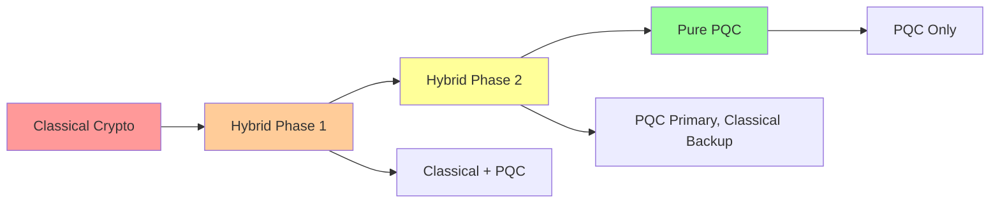

# Quantum-Ready Infrastructure for AOSP

## Overview

Prepare your AOSP development infrastructure for the quantum computing era with post-quantum cryptography, quantum-resistant algorithms, and future-proof security architectures.

## Table of Contents

1. [Post-Quantum Cryptography](#post-quantum-cryptography)
2. [Quantum-Resistant Key Exchange](#quantum-resistant-key-exchange)
3. [Quantum-Safe Data Storage](#quantum-safe-data-storage)
4. [Hybrid Cryptographic Systems](#hybrid-cryptographic-systems)
5. [Quantum Computing Integration](#quantum-computing-integration)

## Post-Quantum Cryptography

### NIST Post-Quantum Standards

Implement NIST-approved post-quantum cryptographic algorithms:

```cpp
// security/crypto/pqc/kyber.h
#include <openssl/evp.h>
#include <pqcrystals/kyber.h>

class KyberKeyExchange {
public:
    // CRYSTALS-KYBER (NIST selected algorithm)
    static constexpr size_t PUBLIC_KEY_SIZE = KYBER_PUBLICKEYBYTES;
    static constexpr size_t SECRET_KEY_SIZE = KYBER_SECRETKEYBYTES;
    static constexpr size_t CIPHERTEXT_SIZE = KYBER_CIPHERTEXTBYTES;
    static constexpr size_t SHARED_SECRET_SIZE = KYBER_SSBYTES;
    
    bool GenerateKeyPair(uint8_t* public_key, uint8_t* secret_key) {
        return pqcrystals_kyber_keypair(public_key, secret_key) == 0;
    }
    
    bool Encapsulate(const uint8_t* public_key,
                     uint8_t* ciphertext,
                     uint8_t* shared_secret) {
        return pqcrystals_kyber_enc(ciphertext, shared_secret, public_key) == 0;
    }
    
    bool Decapsulate(const uint8_t* secret_key,
                     const uint8_t* ciphertext,
                     uint8_t* shared_secret) {
        return pqcrystals_kyber_dec(shared_secret, ciphertext, secret_key) == 0;
    }
};
```

### Dilithium Digital Signatures

```cpp
// security/crypto/pqc/dilithium.h
#include <pqcrystals/dilithium.h>

class DilithiumSigner {
public:
    static constexpr size_t PUBLIC_KEY_SIZE = DILITHIUM_PUBLICKEYBYTES;
    static constexpr size_t SECRET_KEY_SIZE = DILITHIUM_SECRETKEYBYTES;
    static constexpr size_t SIGNATURE_SIZE = DILITHIUM_BYTES;
    
    bool GenerateKeyPair(uint8_t* public_key, uint8_t* secret_key) {
        return pqcrystals_dilithium_keypair(public_key, secret_key) == 0;
    }
    
    bool Sign(const uint8_t* message, size_t message_len,
              const uint8_t* secret_key,
              uint8_t* signature, size_t* signature_len) {
        return pqcrystals_dilithium_signature(
            signature, signature_len,
            message, message_len,
            secret_key
        ) == 0;
    }
    
    bool Verify(const uint8_t* signature, size_t signature_len,
                const uint8_t* message, size_t message_len,
                const uint8_t* public_key) {
        return pqcrystals_dilithium_verify(
            signature, signature_len,
            message, message_len,
            public_key
        ) == 0;
    }
};
```

### SPHINCS+ Hash-Based Signatures

```cpp
// security/crypto/pqc/sphincs.h
#include <sphincs/sphincs.h>

class SphincsPlusSigner {
public:
    bool GenerateKeyPair(uint8_t* public_key, uint8_t* secret_key) {
        return sphincs_shake_256f_keypair(public_key, secret_key) == 0;
    }
    
    bool Sign(const uint8_t* message, size_t message_len,
              const uint8_t* secret_key, uint8_t* signature) {
        return sphincs_shake_256f_sign(
            signature,
            message, message_len,
            secret_key
        ) == 0;
    }
    
    bool Verify(const uint8_t* signature,
                const uint8_t* message, size_t message_len,
                const uint8_t* public_key) {
        return sphincs_shake_256f_verify(
            signature,
            message, message_len,
            public_key
        ) == 0;
    }
};
```

## Quantum-Resistant Key Exchange

### Hybrid TLS Configuration

```cpp
// frameworks/base/core/jni/android_net_TLS.cpp
#include <openssl/ssl.h>
#include "pqc/kyber.h"

class HybridTLSConnection {
private:
    SSL_CTX* ssl_ctx_;
    KyberKeyExchange kyber_;
    
public:
    bool InitializeContext() {
        ssl_ctx_ = SSL_CTX_new(TLS_method());
        
        // Enable hybrid key exchange: ECDHE + Kyber
        SSL_CTX_set_options(ssl_ctx_,
            SSL_OP_NO_SSLv2 | SSL_OP_NO_SSLv3 | SSL_OP_NO_TLSv1 | SSL_OP_NO_TLSv1_1
        );
        
        // Set cipher suites with PQC
        SSL_CTX_set_cipher_list(ssl_ctx_,
            "TLS_AES_256_GCM_SHA384:"
            "TLS_CHACHA20_POLY1305_SHA256:"
            "ECDHE-RSA-AES256-GCM-SHA384:"
            "KYBER768-ECDHE-RSA-AES256-GCM-SHA384"
        );
        
        // Register custom key exchange callback
        SSL_CTX_set_keylog_callback(ssl_ctx_, KeyExchangeCallback);
        
        return true;
    }
    
    static void KeyExchangeCallback(const SSL* ssl, const char* line) {
        // Implement hybrid key exchange
        PerformHybridKeyExchange(ssl);
    }
    
    static bool PerformHybridKeyExchange(const SSL* ssl) {
        // 1. Traditional ECDHE
        uint8_t ecdhe_shared_secret[32];
        PerformECDHE(ssl, ecdhe_shared_secret);
        
        // 2. Kyber KEM
        uint8_t kyber_shared_secret[KYBER_SSBYTES];
        KyberKeyExchange kyber;
        
        uint8_t public_key[KYBER_PUBLICKEYBYTES];
        uint8_t ciphertext[KYBER_CIPHERTEXTBYTES];
        
        kyber.Encapsulate(public_key, ciphertext, kyber_shared_secret);
        
        // 3. Combine secrets using KDF
        uint8_t combined_secret[64];
        HKDF(combined_secret, 64,
             ecdhe_shared_secret, 32,
             kyber_shared_secret, KYBER_SSBYTES);
        
        return true;
    }
};
```

### Quantum-Safe VPN

```java
// frameworks/base/core/java/android/net/VpnService.java
package android.net;

import android.security.pqc.KyberKeyAgreement;
import android.security.pqc.DilithiumSignature;

public class QuantumSafeVpnService extends VpnService {
    private KyberKeyAgreement keyAgreement;
    private DilithiumSignature signature;
    
    @Override
    public void onCreate() {
        super.onCreate();
        
        // Initialize post-quantum crypto
        keyAgreement = new KyberKeyAgreement();
        signature = new DilithiumSignature();
    }
    
    public EstablishConnection(String serverAddress) {
        // 1. Perform Kyber key exchange
        byte[] publicKey = keyAgreement.generatePublicKey();
        byte[] serverPublicKey = exchangeKeys(serverAddress, publicKey);
        byte[] sharedSecret = keyAgreement.deriveSharedSecret(serverPublicKey);
        
        // 2. Authenticate with Dilithium signature
        byte[] authMessage = buildAuthMessage();
        byte[] signatureBytes = signature.sign(authMessage);
        
        if (!verifyServerSignature(serverAddress, signatureBytes)) {
            throw new SecurityException("Server authentication failed");
        }
        
        // 3. Establish encrypted tunnel
        setupEncryptedTunnel(sharedSecret);
    }
}
```

## Quantum-Safe Data Storage

### Encrypted Storage with PQC

```cpp
// system/security/keystore/quantum_safe_storage.cpp
#include <android/security/keystore/IKeystoreService.h>
#include "pqc/kyber.h"
#include "pqc/dilithium.h"

class QuantumSafeStorage {
private:
    static constexpr char KEY_ALIAS[] = "quantum_safe_master_key";
    
public:
    bool EncryptData(const uint8_t* plaintext, size_t plaintext_len,
                     uint8_t* ciphertext, size_t* ciphertext_len) {
        // Generate ephemeral Kyber key pair
        KyberKeyExchange kyber;
        uint8_t public_key[KYBER_PUBLICKEYBYTES];
        uint8_t secret_key[KYBER_SECRETKEYBYTES];
        
        if (!kyber.GenerateKeyPair(public_key, secret_key)) {
            return false;
        }
        
        // Encapsulate to derive encryption key
        uint8_t shared_secret[KYBER_SSBYTES];
        uint8_t kyber_ciphertext[KYBER_CIPHERTEXTBYTES];
        
        if (!kyber.Encapsulate(public_key, kyber_ciphertext, shared_secret)) {
            return false;
        }
        
        // Derive AES key from shared secret
        uint8_t aes_key[32];
        HKDF(aes_key, 32, shared_secret, KYBER_SSBYTES);
        
        // Encrypt data with AES-256-GCM
        EVP_CIPHER_CTX* ctx = EVP_CIPHER_CTX_new();
        EVP_EncryptInit_ex(ctx, EVP_aes_256_gcm(), NULL, aes_key, NULL);
        
        int len;
        EVP_EncryptUpdate(ctx, ciphertext, &len, plaintext, plaintext_len);
        *ciphertext_len = len;
        
        EVP_EncryptFinal_ex(ctx, ciphertext + len, &len);
        *ciphertext_len += len;
        
        EVP_CIPHER_CTX_free(ctx);
        
        // Sign with Dilithium for authenticity
        DilithiumSigner signer;
        uint8_t signature[DILITHIUM_BYTES];
        size_t signature_len;
        
        // Get signing key from keystore
        uint8_t signing_key[DILITHIUM_SECRETKEYBYTES];
        GetSigningKey(KEY_ALIAS, signing_key);
        
        signer.Sign(ciphertext, *ciphertext_len, signing_key,
                    signature, &signature_len);
        
        // Append signature to ciphertext
        memcpy(ciphertext + *ciphertext_len, signature, signature_len);
        *ciphertext_len += signature_len;
        
        return true;
    }
};
```

### Quantum-Safe Key Derivation

```python
# scripts/quantum_safe_kdf.py
import hashlib
import hmac
from Crypto.Cipher import AES
from Crypto.Random import get_random_bytes

class QuantumSafeKDF:
    """Quantum-resistant key derivation function"""
    
    def __init__(self):
        self.iterations = 1000000  # High iteration count
        
    def derive_key(self, password, salt, key_length=32):
        """
        Derive cryptographic key using multiple hash functions
        to provide quantum resistance
        """
        # Use multiple hash functions (hash agility)
        sha3_key = hashlib.sha3_512(password + salt).digest()
        blake2_key = hashlib.blake2b(password + salt, digest_size=64).digest()
        shake_key = hashlib.shake_256(password + salt).digest(64)
        
        # Combine outputs
        combined = sha3_key + blake2_key + shake_key
        
        # Apply PBKDF2 with high iteration count
        derived = hashlib.pbkdf2_hmac(
            'sha3-512',
            combined,
            salt,
            self.iterations,
            dklen=key_length
        )
        
        return derived
    
    def encrypt_with_derived_key(self, data, password):
        """Encrypt data with quantum-safe derived key"""
        salt = get_random_bytes(32)
        key = self.derive_key(password.encode(), salt)
        
        # Use AES-256-GCM (quantum-resistant against known attacks)
        cipher = AES.new(key, AES.MODE_GCM)
        ciphertext, tag = cipher.encrypt_and_digest(data)
        
        # Return salt + nonce + tag + ciphertext
        return salt + cipher.nonce + tag + ciphertext
```

## Hybrid Cryptographic Systems

### Transition Strategy



### Hybrid Signature Scheme

```cpp
// security/crypto/hybrid_signature.cpp
class HybridSignature {
public:
    struct Signature {
        uint8_t ecdsa_signature[72];  // Classical
        uint8_t dilithium_signature[DILITHIUM_BYTES];  // PQC
    };
    
    bool Sign(const uint8_t* message, size_t message_len,
              const KeyPair& keys, Signature* signature) {
        // Sign with both algorithms
        bool ecdsa_ok = SignECDSA(message, message_len,
                                  keys.ecdsa_key,
                                  signature->ecdsa_signature);
        
        bool dilithium_ok = SignDilithium(message, message_len,
                                          keys.dilithium_key,
                                          signature->dilithium_signature);
        
        return ecdsa_ok && dilithium_ok;
    }
    
    bool Verify(const uint8_t* message, size_t message_len,
                const PublicKeys& public_keys,
                const Signature& signature) {
        // Verify both signatures (both must pass)
        bool ecdsa_valid = VerifyECDSA(message, message_len,
                                       public_keys.ecdsa_public,
                                       signature.ecdsa_signature);
        
        bool dilithium_valid = VerifyDilithium(message, message_len,
                                               public_keys.dilithium_public,
                                               signature.dilithium_signature);
        
        // Security property: both must be valid
        return ecdsa_valid && dilithium_valid;
    }
};
```

## Quantum Computing Integration

### Quantum Algorithm Simulation

```python
# scripts/quantum_simulator.py
from qiskit import QuantumCircuit, execute, Aer
from qiskit.algorithms import Grover
import numpy as np

class QuantumOptimizer:
    """Use quantum algorithms for build optimization"""
    
    def __init__(self):
        self.simulator = Aer.get_backend('qasm_simulator')
        
    def optimize_build_order(self, dependencies):
        """
        Use Grover's algorithm to find optimal build order
        """
        # Convert dependency graph to quantum circuit
        n_qubits = len(dependencies)
        qc = QuantumCircuit(n_qubits, n_qubits)
        
        # Encode dependencies as oracle
        oracle = self.create_dependency_oracle(dependencies)
        
        # Apply Grover's algorithm
        grover = Grover(oracle=oracle)
        result = grover.amplify()
        
        # Measure results
        qc.measure(range(n_qubits), range(n_qubits))
        job = execute(qc, self.simulator, shots=1000)
        counts = job.result().get_counts()
        
        # Extract optimal order
        optimal_order = max(counts, key=counts.get)
        return self.decode_build_order(optimal_order, dependencies)
    
    def create_dependency_oracle(self, dependencies):
        """Create quantum oracle for dependency checking"""
        # Implement oracle that marks valid build orders
        pass
```

### Quantum-Safe API Design

```java
// frameworks/base/core/java/android/security/quantum/QuantumSafeAPI.java
package android.security.quantum;

import java.security.KeyPair;
import java.security.PublicKey;

/**
 * Quantum-safe cryptographic API for Android
 * Provides post-quantum secure operations
 */
public class QuantumSafeAPI {
    
    /**
     * Generate quantum-safe key pair
     */
    public static KeyPair generateQuantumSafeKeyPair() {
        // Generate hybrid key pair (ECDSA + Dilithium)
        KeyPairGenerator classical = KeyPairGenerator.getInstance("EC");
        KeyPairGenerator pqc = KeyPairGenerator.getInstance("Dilithium");
        
        return new HybridKeyPair(
            classical.generateKeyPair(),
            pqc.generateKeyPair()
        );
    }
    
    /**
     * Encrypt data with quantum-safe algorithm
     */
    public static byte[] quantumSafeEncrypt(byte[] plaintext, PublicKey publicKey) {
        // Use Kyber for key encapsulation
        KyberCipher cipher = new KyberCipher();
        cipher.init(Cipher.ENCRYPT_MODE, publicKey);
        return cipher.doFinal(plaintext);
    }
    
    /**
     * Quantum-safe digital signature
     */
    public static byte[] quantumSafeSign(byte[] message, PrivateKey privateKey) {
        // Use Dilithium for signing
        Signature signature = Signature.getInstance("Dilithium3");
        signature.initSign(privateKey);
        signature.update(message);
        return signature.sign();
    }
}
```

## Migration Guidelines

### Phase 1: Assessment (Months 1-3)

```bash
#!/bin/bash
# scripts/assess_quantum_readiness.sh

echo "Assessing Quantum Readiness..."

# 1. Identify classical cryptography usage
echo "Scanning for classical crypto..."
grep -r "RSA\|ECDSA\|DH" --include="*.{cpp,java,h}" > crypto_usage.txt

# 2. Analyze key sizes
echo "Checking key sizes..."
find . -name "*.cpp" -exec grep -H "KEY_SIZE" {} \; > key_sizes.txt

# 3. Check TLS configurations
echo "Analyzing TLS configs..."
find . -name "*.xml" -exec grep -H "TLS\|SSL" {} \; > tls_configs.txt

# 4. Generate report
python3 << EOF
import json

report = {
    "classical_crypto_count": $(wc -l < crypto_usage.txt),
    "weak_keys": $(grep -c "1024\|512" key_sizes.txt),
    "tls_configs": $(wc -l < tls_configs.txt),
    "recommendation": "Migrate to PQC"
}

print(json.dumps(report, indent=2))
EOF
```

### Phase 2: Implementation (Months 4-12)

1. Deploy hybrid cryptography
2. Update all key exchanges
3. Implement PQC in critical paths
4. Add quantum-safe signatures
5. Update certificate infrastructure

### Phase 3: Validation (Months 13-18)

```python
# scripts/validate_pqc_implementation.py
import subprocess

def validate_pqc():
    """Validate post-quantum cryptography implementation"""
    
    checks = [
        ("Kyber Implementation", check_kyber),
        ("Dilithium Signatures", check_dilithium),
        ("Hybrid TLS", check_hybrid_tls),
        ("Key Storage", check_quantum_safe_storage),
    ]
    
    results = []
    for name, check_func in checks:
        try:
            result = check_func()
            results.append((name, "PASS" if result else "FAIL"))
        except Exception as e:
            results.append((name, f"ERROR: {e}"))
    
    return results
```

## Performance Considerations

### PQC Performance Metrics

| Algorithm | Key Gen | Sign/Encrypt | Verify/Decrypt | Key Size |
|-----------|---------|--------------|----------------|----------|
| RSA-2048 | 100ms | 5ms | 1ms | 2048 bits |
| ECDSA-256 | 10ms | 2ms | 4ms | 256 bits |
| Dilithium3 | 50ms | 20ms | 15ms | 1952 bytes |
| Kyber768 | 30ms | 35ms | 30ms | 1184 bytes |
| SPHINCS+ | 15000ms | 50000ms | 1ms | 64 bytes |

### Optimization Strategies

```cpp
// Optimize PQC operations
class OptimizedPQC {
public:
    // Use AVX2/AVX-512 for NTT operations
    void OptimizedNTT(int16_t* coeffs, size_t n) {
        #ifdef __AVX2__
        // Vector NTT implementation
        __m256i vec = _mm256_load_si256((__m256i*)coeffs);
        // ... vectorized operations
        #else
        // Fallback to scalar
        ScalarNTT(coeffs, n);
        #endif
    }
    
    // Batch operations
    void BatchKeyGeneration(size_t count) {
        // Generate multiple keys in parallel
        #pragma omp parallel for
        for (size_t i = 0; i < count; i++) {
            GenerateKeyPair(&keys[i]);
        }
    }
};
```

## Best Practices

1. **Always use hybrid schemes** during transition
2. **Implement crypto agility** for algorithm changes
3. **Monitor PQC standards** (NIST updates)
4. **Test performance impact** before deployment
5. **Plan for key size increases** (storage, bandwidth)
6. **Use hardware acceleration** when available
7. **Implement quantum random number generation**

## Resources

- [NIST Post-Quantum Cryptography](https://csrc.nist.gov/projects/post-quantum-cryptography)
- [Open Quantum Safe](https://openquantumsafe.org/)
- [PQCrypto](https://pqcrypto.org/)
- [ETSI Quantum-Safe Cryptography](https://www.etsi.org/technologies/quantum-safe-cryptography)

## Conclusion

Quantum computing represents both a threat and an opportunity. By implementing post-quantum cryptography now, AOSP systems can remain secure in the quantum era while taking advantage of quantum computing capabilities for optimization and innovation.
